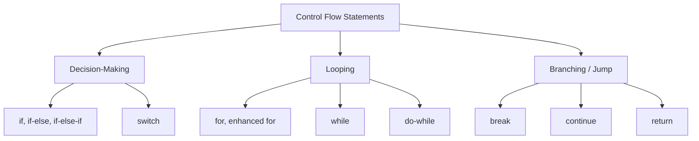

## What is a Block in Java?

- A block is any code enclosed within curly braces `{ }`. It groups multiple statements together so they are treated as a single unit.
- Blocks define **scope** — variables declared inside a block exist only within that block and are destroyed once the block finishes executing.

### Types of Blocks in Java

| Block Type | Runs When | Example |
|---|---|---|
| **Instance Block** | Runs every time an object is created, right before the constructor body executes | `{ System.out.println("Instance block"); }` (written directly inside a class, outside any method) |
| **Static Block** | Runs only **once**, when the class is first loaded into memory (during class initialization) | `static { System.out.println("Static block"); }` |
| **Method Block** | Runs whenever the method is called | The `{ }` body of any method |
| **Local Block** | An arbitrary `{ }` block written inside a method to intentionally limit a variable's scope | A standalone `{ int x = 5; }` inside a method |

```java
public class Demo {
    static {
        System.out.println("Static block - runs once at class loading");
    }

    {
        System.out.println("Instance block - runs every time an object is created");
    }

    public Demo() {
        System.out.println("Constructor - runs after the instance block");
    }
}
```

**Execution order when an object is created:** Static block (only on first class load) → Instance block → Constructor.

> **Note:** Static blocks are commonly used for one-time setup logic, like loading configuration, initializing static resources (e.g., a database connection pool), or setting complex static field values that can't be assigned in a single line.

---

## Methods in Java

A method is a named, reusable block of code that performs a specific task and can be called from elsewhere in the program.

### Method Declaration Syntax

```java
accessModifier  staticOrNot  returnType  methodName(parameterList) throws ExceptionType {
    // method body
    return value; // only if returnType is not void
}
```

### Breaking Down the Method Signature

```java
public static int calculateTotal(int price, int quantity) throws IllegalArgumentException {
    return price * quantity;
}
```

| Part | Meaning |
|---|---|
| `public` | Access modifier — controls visibility (`public`, `private`, `protected`, or default/package-private) |
| `static` | Optional — belongs to the class rather than an instance, if present |
| `int` | Return type — the data type of the value the method sends back (`void` if it returns nothing) |
| `calculateTotal` | Method name — should be a verb or verb phrase, in camelCase by convention |
| `(int price, int quantity)` | Parameter list — the inputs the method accepts |
| `throws IllegalArgumentException` | Optional — declares checked exceptions the method might throw |
| `{ ... }` | Method body — the actual logic |

### Method Overloading

Multiple methods can share the same name as long as their **parameter list differs** (different number, type, or order of parameters). The return type alone is **not** enough to distinguish overloaded methods.

```java
public int add(int a, int b) { return a + b; }
public double add(double a, double b) { return a + b; }
public int add(int a, int b, int c) { return a + b + c; }
```

### Key Rules for Declaring Methods

- A method name must follow identifier rules (no spaces, can't start with a digit, case sensitive).
- If the return type is not `void`, every code path in the method **must** return a value of that type (or a compile error occurs).
- Parameters are passed **by value** in Java — for primitives, a copy of the value is passed; for objects, a copy of the reference (address) is passed.
- `static` methods cannot directly call non-static (instance) methods or access instance fields without an object reference.
- A method can have **zero or more** parameters, but no two parameters can share the same name within the same method.

---

## Control Flow Statements

Control flow statements determine the **order** in which individual statements, instructions, or function calls are executed. Java provides three broad categories: **Decision-Making**, **Looping**, and **Branching (jump)** statements.



### 1. `if` Statement

Executes a block only if a condition is `true`.

```java
if (age >= 18) {
    System.out.println("Eligible to vote");
}
```

### 2. `if-else` Statement

Executes one block if the condition is `true`, another if `false`.

```java
if (marks >= 40) {
    System.out.println("Pass");
} else {
    System.out.println("Fail");
}
```

### 3. `if-else-if` Ladder

Used to check multiple conditions in sequence; the first `true` condition's block runs, and the rest are skipped.

```java
if (marks >= 90) {
    System.out.println("Grade A");
} else if (marks >= 75) {
    System.out.println("Grade B");
} else if (marks >= 50) {
    System.out.println("Grade C");
} else {
    System.out.println("Fail");
}
```

### 4. `switch` Statement (Traditional)

Used when a single variable is checked against many possible constant values — a cleaner alternative to a long `if-else-if` ladder.

```java
switch (day) {
    case 1:
        System.out.println("Monday");
        break;
    case 2:
        System.out.println("Tuesday");
        break;
    default:
        System.out.println("Invalid day");
}
```

- Without `break`, execution **"falls through"** into the next case, running every subsequent case's code until a `break` or the end of the switch is reached.
- `switch` works with `byte`, `short`, `char`, `int`, their wrapper classes, `String` (since Java 7), and `enum` types.

### Enhanced `switch` Expression (Java 14+)

A modern form that avoids fall-through by default and can directly return a value.

```java
String dayType = switch (day) {
    case 1, 2, 3, 4, 5 -> "Weekday";
    case 6, 7 -> "Weekend";
    default -> "Invalid day";
};
```

> **Note:** The enhanced switch uses `->` instead of `:` and doesn't need `break` — each branch only executes its own case, by design.

---

## Loops in Java

Loops let a block of code execute repeatedly, either a fixed number of times, until a condition is no longer true, or once per element in a collection.

### 1. `for` Loop

Best used when the **number of iterations is known in advance** or easily computable (counting, indexing).

**Syntax:**
```java
for (initialization; condition; update) {
    // code to repeat
}
```

```java
for (int i = 0; i < 5; i++) {
    System.out.println("Iteration: " + i);
}
```

**When to use:** Iterating a fixed number of times, iterating over arrays/lists by index, or when you need control over the step/increment logic (e.g., `i += 2`).

### 2. Enhanced `for` Loop (For-Each)

A simplified `for` loop specifically designed to iterate over arrays and collections without manually managing an index.

```java
int[] numbers = {10, 20, 30, 40};
for (int num : numbers) {
    System.out.println(num);
}
```

**When to use:** When you just need to **read** every element in a collection/array in order and don't need the index or need to modify the collection during iteration.

> **Note:** You cannot use the for-each loop to modify the original array/collection's structure (like removing elements) — doing so on a `List` during a for-each will throw a `ConcurrentModificationException`.

### 3. `while` Loop

Best used when the number of iterations is **not known in advance**, and depends entirely on a condition that's checked **before** each iteration.

**Syntax:**
```java
while (condition) {
    // code to repeat
}
```

```java
int count = 0;
while (count < 5) {
    System.out.println("Count: " + count);
    count++;
}
```

**When to use:** Reading input until a sentinel value is found, polling until a resource becomes available, or any scenario where you might not want the loop to run at all if the condition is false from the start.

### 4. `do-while` Loop

Similar to `while`, but the condition is checked **after** the loop body runs — guaranteeing the loop body executes **at least once**, regardless of the condition.

**Syntax:**
```java
do {
    // code to repeat
} while (condition);
```

```java
int attempts = 0;
do {
    System.out.println("Attempt: " + attempts);
    attempts++;
} while (attempts < 3);
```

**When to use:** Menu-driven programs, input validation prompts, or retry logic — any situation where the action must happen at least once before checking whether to repeat it (e.g., "show the menu once, then keep showing it until the user chooses to exit").

---

## Loop Comparison — When to Use Which

| Loop | Best When | Minimum Executions |
|---|---|---|
| `for` | Iteration count is known or easily calculable | 0 (can skip entirely if condition starts false) |
| Enhanced `for` (for-each) | Reading every element of an array/collection | 0 |
| `while` | Condition-driven, iteration count unknown upfront | 0 |
| `do-while` | Must run at least once before checking the condition | 1 (always runs once) |

---

## Branching / Jump Statements

### `break`

- Immediately exits the nearest enclosing loop or `switch` statement.

```java
for (int i = 0; i < 10; i++) {
    if (i == 5) break;   // stops the loop entirely once i == 5
    System.out.println(i);
}
```

### `continue`

- Skips the rest of the current iteration and moves directly to the next one.

```java
for (int i = 0; i < 5; i++) {
    if (i == 2) continue;   // skips printing when i == 2
    System.out.println(i);
}
```

### Labeled `break` / `continue`

- Used to control an **outer** loop from within a **nested** loop.

```java
outer:
for (int i = 0; i < 3; i++) {
    for (int j = 0; j < 3; j++) {
        if (j == 1) continue outer;   // skips to the next iteration of the OUTER loop
        System.out.println(i + ", " + j);
    }
}
```

### `return`

- Immediately exits the current method, optionally sending a value back to the caller.

```java
public int getStatus(boolean active) {
    if (!active) {
        return -1;   // exits immediately, skipping the rest of the method
    }
    return 1;
}
```

---

## Interview & Tricky Questions

1. What is the difference between a static block and an instance block?
2. In what order do the static block, instance block, and constructor execute when an object is created?
3. How many times does a static block run if you create 100 objects of the same class?
4. What is method overloading, and why can't two methods differ only by return type?
5. Are Java parameters passed by value or by reference?
6. If an object reference is passed to a method and the method modifies the object's field, does the change persist outside the method? Why?
7. What happens if a non-void method has a code path that doesn't return a value?
8. What is the difference between `if-else-if` and `switch`, and when would you prefer one over the other?
9. What happens if you forget a `break` statement inside a traditional `switch` case?
10. What data types can a traditional `switch` statement work with?
11. How does the enhanced switch expression (Java 14+) avoid the fall-through problem?
12. What is the key structural difference between a `while` loop and a `do-while` loop?
13. Can a `do-while` loop execute zero times? Why or why not?
14. When would you prefer a `for` loop over a `while` loop?
15. Why can't you remove elements from a `List` while iterating with an enhanced for-each loop?
16. What exception is thrown when you modify a collection during a for-each loop, and why does it happen?
17. What is the difference between `break` and `continue`?
18. What is a labeled loop, and when would you need one?
19. Can you use `continue` with a `switch` statement directly?
20. What is the scope of a variable declared inside a `for` loop's initialization section?
21. What happens if the condition in a `for` loop is omitted entirely (e.g., `for (;;) { }`)?
22. Why is it recommended to avoid deeply nested loops in production code, and what alternatives exist?