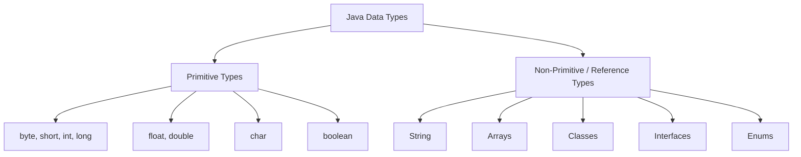
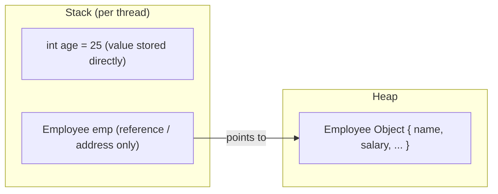
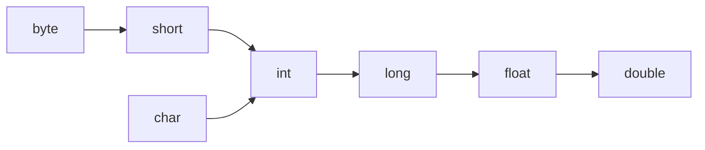

## What are Data Types in Java?

- A data type defines what **kind of value** a variable can hold and what **operations** can be performed on it.
- Java is a **statically typed** language — every variable must have its data type declared at compile time, and that type cannot change later.
- Java data types are broadly divided into two categories: **Primitive** and **Non-Primitive (Reference) Types**.



---

## Why Java is NOT a 100% Pure Object-Oriented Language

- A purely object-oriented language treats **everything** as an object (like Smalltalk or Ruby).
- Java has **8 primitive data types** (`byte`, `short`, `int`, `long`, `float`, `double`, `char`, `boolean`) that are **not objects** — they don't have methods, don't inherit from `Object`, and are stored directly as raw values, not as instances of a class.
- Because these primitives exist purely for performance (faster to store and process than full objects), Java cannot be classified as 100% object-oriented — it's often described as an **"object-oriented language with primitive support"** or a **hybrid OOP language**.

> **Note:** Java does provide **Wrapper classes** (`Integer`, `Double`, `Character`, `Boolean`, etc.) that wrap a primitive inside an actual object — this is what lets primitives be used in collections like `ArrayList<Integer>`, which only accept objects, not raw primitives. The automatic conversion between a primitive and its wrapper is called **autoboxing** (primitive → object) and **unboxing** (object → primitive).

```java
int a = 10;              // primitive
Integer b = 10;          // autoboxing: primitive wrapped into an Integer object
int c = b;               // unboxing: object converted back into a primitive
```

---

## Primitive Data Types — In Depth

There are **8 primitive types** in Java, split into 4 groups: Integer types, Floating-point types, Character type, and Boolean type.

| Data Type | Size | Default Value | Range | Wrapper Class |
|---|---|---|---|---|
| `byte` | 1 byte (8 bits) | `0` | -128 to 127 | `Byte` |
| `short` | 2 bytes (16 bits) | `0` | -32,768 to 32,767 | `Short` |
| `int` | 4 bytes (32 bits) | `0` | -2,147,483,648 to 2,147,483,647 | `Integer` |
| `long` | 8 bytes (64 bits) | `0L` | -9,223,372,036,854,775,808 to 9,223,372,036,854,775,807 | `Long` |
| `float` | 4 bytes (32 bits) | `0.0f` | ~ ±3.4 × 10³⁸ (single precision, ~6-7 decimal digits) | `Float` |
| `double` | 8 bytes (64 bits) | `0.0d` | ~ ±1.7 × 10³⁰⁸ (double precision, ~15-16 decimal digits) | `Double` |
| `char` | 2 bytes (16 bits) | `'\u0000'` | 0 to 65,535 (unsigned, holds a single Unicode character) | `Character` |
| `boolean` | JVM-dependent (not precisely defined by spec; typically 1 bit conceptually, often 1 byte in practice) | `false` | `true` or `false` only | `Boolean` |

> **Note:** `boolean`'s exact size is deliberately left **unspecified** by the JVM specification — implementations are free to use whatever size is efficient for that platform, since a boolean only ever needs to represent 2 states.

### How to Declare Primitive Types

```java
byte age = 25;
short year = 2026;
int population = 1_400_000_000;     // underscores allowed for readability
long distance = 9999999999L;        // 'L' suffix REQUIRED for large long literals
float price = 99.99f;               // 'f' suffix REQUIRED, otherwise treated as double
double preciseValue = 3.14159265358979;
char grade = 'A';                   // single quotes only
boolean isActive = true;
```

### Restrictions & Rules When Declaring Primitives

1. **Literal suffixes matter:**
   - A whole number literal is treated as `int` by default — assigning it to a `long` variable beyond the `int` range **without an `L` suffix** causes a compile error.
     ```java
     long big = 10000000000;   // ERROR: integer literal too large for int
     long big = 10000000000L;  // Correct
     ```
   - A decimal literal is treated as `double` by default — assigning it to a `float` **without an `f` suffix** causes a compile error, since you'd be narrowing a `double` into a `float` implicitly.
     ```java
     float price = 99.99;   // ERROR: possible lossy conversion from double to float
     float price = 99.99f;  // Correct
     ```

2. **Range restrictions:** A value outside a type's declared range cannot be assigned directly.
   ```java
   byte b = 128;   // ERROR: byte range is -128 to 127
   ```

3. **`char` restrictions:** Must be a single character in single quotes, a Unicode escape, or an integer value representing a Unicode code point — never a string in double quotes.
   ```java
   char c = 'A';        // valid
   char c = 65;         // valid (65 = 'A' in Unicode)
   char c = "A";         // ERROR: incompatible types (String vs char)
   ```

4. **`final` variables:** Once declared `final`, a primitive's value **cannot be reassigned** after initialization.
   ```java
   final int MAX_USERS = 100;
   MAX_USERS = 200;   // ERROR: cannot assign a value to final variable
   ```

5. **Local variables must be initialized before use** — unlike instance/static fields (which get default values automatically), local variables inside a method have no default value and will cause a compile error if used uninitialized.

6. **`var` (local variable type inference, Java 10+):**
   - `var` can infer a primitive or reference type, but only for **local variables** — never for fields, method parameters, or return types.
   - A `var` variable **must be initialized at the point of declaration** (the compiler needs a value to infer the type from).
   ```java
   var count = 10;       // inferred as int
   var name;              // ERROR: cannot infer type without initializer
   var field = 5;         // ERROR if used as a class-level field (not allowed)
   ```

---

## Non-Primitive (Reference) Data Types

- Reference types **do not store the actual value directly** — they store a **reference (memory address)** pointing to where the actual object lives in the Heap.
- Includes: **Classes, Interfaces, Arrays, Enums, String** (String is technically a class, but treated almost like a built-in type due to language-level support like string literals and the `+` operator).
- Default value of any reference type (if declared as a field, not local variable) is **`null`** — meaning "points to nothing."

### How to Declare Non-Primitive Types

```java
String name = "John";                       // String object
int[] numbers = {1, 2, 3, 4};               // Array
Employee emp = new Employee();              // Custom class object
List<String> names = new ArrayList<>();     // Interface reference, class instance
Day today = Day.MONDAY;                     // Enum
```

### Restrictions on Non-Primitive Declarations

- You **cannot instantiate an interface directly** — `new SomeInterface()` is invalid; you must provide a concrete implementing class.
- Abstract classes similarly **cannot be instantiated directly**.
- Array size, once defined, is **fixed** — you cannot resize a Java array after creation (you'd need to create a new one, which is what `ArrayList` handles internally for you).
- Generic types (`List<T>`) **cannot use primitives directly** as type parameters — you must use the wrapper class (`List<Integer>`, not `List<int>`).

---

## Where and How Data Types Are Stored in Memory

| Type | Where it's stored | Details |
|---|---|---|
| **Primitive local variable** | **Stack** (inside the current method's stack frame) | Stored directly by value; destroyed the moment the method returns. |
| **Primitive instance field** | **Heap**, as part of the containing object | Lives as long as the object itself lives (part of the object's memory layout). |
| **Primitive static field** | **Method Area / Metaspace** | Shared across all instances, exists for the lifetime of the class. |
| **Reference variable (local)** | **Stack** stores the reference (memory address); the actual object it points to is in the **Heap** | The variable itself is just a pointer living on the stack. |
| **Object itself (e.g., `new Employee()`)** | **Heap** | The actual object data lives here, regardless of where the reference pointing to it is stored. |
| **String literals (`"abc"`)** | **String Constant Pool** (inside the Heap, Java 7+) | Reused/shared automatically if the same literal already exists. |



> **Note:** This is exactly why passing a primitive to a method passes a **copy of the value** (changes inside the method don't affect the original), while passing an object reference passes a **copy of the address** — the method can still modify the actual object's internal state through that shared address, even though it can't reassign what the original variable points to.

---

## Widening and Narrowing — Type Casting in Java

Type casting is converting a value of one data type into another. Java supports two kinds:

### 1. Widening (Implicit / Automatic Type Conversion)

- Converts a **smaller** data type into a **larger** one.
- Done **automatically** by the compiler — no explicit cast needed, because there's no risk of data loss.
- Follows a strict hierarchy:



```java
int a = 100;
long b = a;        // widening: int → long, automatic
long c = 1000L;
float d = c;        // widening: long → float, automatic
float e = 5.5f;
double f = e;        // widening: float → double, automatic
```

> **Note:** `char` widens directly into `int` (and beyond), but `byte` and `short` do **not** automatically widen into `char` — because `char` is unsigned and `byte`/`short` are signed, so implicit conversion could silently misrepresent negative values.

### 2. Narrowing (Explicit / Manual Type Conversion)

- Converts a **larger** data type into a **smaller** one.
- Must be done **explicitly** using a cast operator `(type)`, because data loss or unexpected results are possible.

```java
double d = 9.78;
int i = (int) d;          // narrowing: double → int, explicit cast required
System.out.println(i);    // 9 (decimal part is truncated, not rounded)

long bigValue = 130L;
byte b = (byte) bigValue;  // narrowing: long → byte
System.out.println(b);    // -126 (value overflows the byte range and wraps around)
```

> **Note:** Narrowing doesn't round — it **truncates** (for decimals) and can **overflow/wrap around** (for out-of-range integers), which is a classic source of subtle bugs if done carelessly.

### Widening vs Narrowing — Quick Comparison

| Aspect | Widening | Narrowing |
|---|---|---|
| Direction | Smaller type → Larger type | Larger type → Smaller type |
| Cast required? | No (automatic) | Yes (explicit) |
| Data loss risk | None | Possible (truncation, overflow) |
| Example | `int` → `long` | `double` → `int` |

---

## `static` vs Non-Static — A Brief Introduction

| Aspect | `static` | Non-Static (Instance) |
|---|---|---|
| Belongs to | The **class** itself | Each individual **object/instance** |
| Memory | Stored once in the **Method Area/Metaspace** | Stored separately in the **Heap**, once per object |
| Access | Can be accessed directly via the class name (`ClassName.member`) | Requires an object reference to access (`object.member`) |
| Shared across instances? | Yes — one copy shared by all objects | No — every object gets its own independent copy |
| Common use case | Utility methods, constants, counters, shared configuration | Object-specific state, like a `Person`'s `name` or `age` |

```java
public class Counter {
    static int totalObjectsCreated = 0;   // shared across ALL instances
    int id;                               // unique per instance

    public Counter() {
        totalObjectsCreated++;
        id = totalObjectsCreated;
    }
}
```

Every time a new `Counter` object is created, `totalObjectsCreated` (static) increases and is shared/visible across every instance, while `id` (non-static) is unique to each individual object.

> **Note:** A `static` method **cannot directly access non-static (instance) members**, because a static method belongs to the class and can be called without any object existing at all — so there's no guaranteed instance to pull instance data from.

---

## Interview & Tricky Questions

1. Why is Java not considered a 100% pure object-oriented language?
2. What are wrapper classes, and why are they needed?
3. What is autoboxing and unboxing? Give an example.
4. Why does `byte b = 128;` fail to compile?
5. Why is an `L` suffix required for large `long` literals but not for smaller ones?
6. Why does `float price = 99.99;` fail to compile without an `f` suffix?
7. What is the default value of a `boolean` field vs a local `boolean` variable?
8. Why doesn't the JVM specification define an exact size for `boolean`?
9. What is the actual memory range and size of a `char` in Java, and why is it unsigned?
10. Why can `char` be assigned an `int` value like `char c = 65;`, but not a `String` like `char c = "A";`?
11. What is the difference between widening and narrowing type conversion?
12. Why does widening happen automatically but narrowing requires an explicit cast?
13. What happens when you narrow a `double` to an `int` — is the value rounded or truncated?
14. What happens when a `long` value outside the `byte` range is narrowed into a `byte`?
15. Why can `byte` and `short` not widen automatically into `char`?
16. What is the difference between primitive types and reference types in terms of memory storage?
17. Where exactly is a local primitive variable stored — Stack or Heap?
18. Where is an object's actual data stored when you write `Employee e = new Employee();`?
19. What gets stored on the Stack when you create a reference variable pointing to a Heap object?
20. Why does passing a primitive to a method not affect the original variable, while passing an object reference can still affect the object's internal state?
21. What is the default value of an uninitialized instance field of type `int`? What about a local variable of type `int`?
22. Why must local variables be explicitly initialized before use, but instance/static fields don't need to be?
23. What is `var` in Java, and what restrictions does it have?
24. Why can't `var` be used for class-level fields or method parameters?
25. Can you declare a `List<int>` in Java? Why or why not?
26. What is the difference between `static` and non-static members in terms of memory allocation?
27. Why can't a `static` method access non-static instance variables directly?
28. Can a `static` method be called using an object reference instead of the class name? Is it good practice?
29. What is the significance of `final` when applied to a primitive variable?
30. Why does the String Constant Pool exist, and how does it relate to how `String` objects are stored compared to primitives?