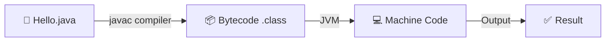

# Introduction to Java

## 📌 What is Java?

Java is a **high-level, object-oriented programming language**.

| Term | Meaning |
|------|---------|
| **High-level** | Easy for programmers to read and write |
| **Object-oriented** | Everything is represented using objects |

### ✨ Key Features
- 🔑 The most important feature of Java is **platform independence**
- 🏢 Developed by **Sun Microsystems** (1995), now maintained by **Oracle**
- 🌐 Used for web apps, mobile apps, enterprise systems, desktop software, and more
- ♻️ Java lets us **write a program once and run it anywhere**

> 💡 **Note:** The original name of Java was **"Oak"**, created by *James Gosling*. It was renamed to Java in 1995 before its official release.

---

## 🚀 Why Java?

### Core Advantages
- ✅ **Platform Independent** — Run anywhere
- ✅ **Object Oriented** — Clean, modular code
- ✅ **Secure & Robust** — Trusted for critical systems
- ✅ **Multithreading** — Efficient concurrent processing

Java became popular because it solved many problems faced by older languages. It is platform independent, meaning the same program can run on different systems. It is secure, which is why it is widely used in banking and enterprise applications. Java is also robust, meaning it handles errors and memory very well.

---

## 🌍 Real-World Applications

| Industry | Use Case |
|----------|----------|
| 🏦 **Banking** | Transaction systems, fraud detection |
| 📱 **Mobile** | Android app development |
| 🖥️ **Backend** | REST APIs, microservices |
| 🏢 **Enterprise** | Large-scale business applications |

> 💡 **Note:** Android app development uses Java (and Kotlin) heavily, and most enterprise-grade backend systems (banking, insurance, telecom) still run on Java because of its stability and long-term support.

---

## 📝 Java Program Structure

```java
class Hello {
    public static void main(String[] args) {
        System.out.println("Hello Java");
    }
}
```

### 🔍 Breaking Down the Structure
- 📦 **Class** → Blueprint of the program
- 🎯 **`main()`** → Entry point of execution
- ⚙️ **JVM** → Starts execution from `main()`
- 🏠 Every Java program runs inside a class

> ⚠️ **Note:** The signature `public static void main(String[] args)` is fixed — the JVM calls this exact method, so changing its signature (e.g., removing `static`) will stop the program from running as expected.

---

## ⚙️ How Java Works

### 🔄 Compilation & Execution Flow



### 📋 Step-by-Step Process

1. ✍️ **Write code** → `Hello.java`
2. 🔨 **Compile using `javac`** → Converts source code to bytecode
3. 📦 **Bytecode** → Platform independent, stored in `.class` file
4. 🔄 **JVM** → Converts bytecode into machine code
5. 🎉 **Output is produced**

First, we write the Java source code and save it with the `.java` extension. Then the Java compiler converts it into bytecode. This bytecode is platform independent. The JVM converts the bytecode into machine code based on the operating system.

> 🎯 **Key Concept:** That is why Java is called **"Write Once, Run Anywhere"** (WORA). Java is both **compiled** and **interpreted**.

---

## 🧩 OOP Concepts

Java follows object-oriented programming. The core concepts are:

| Concept | Description |
|---------|-------------|
| **Class** | A blueprint of an object |
| **Object** | An instance of a class |
| **Inheritance** | Code reusability — one class acquires properties of another |
| **Polymorphism** | One method/object behaves differently in different contexts |
| **Encapsulation** | Data hiding — private fields exposed through methods |
| **Abstraction** | Show essential details, hide internal complexities |

> 💡 **Memory Trick:** Encapsulation hides **data**, Abstraction hides **implementation details**.

---

## 🎤 Interview & Tricky Questions

### 1. ❓ Why is Java called platform independent if the JVM itself is platform dependent?

**Answer:** Because the bytecode Java produces is the same across all systems — only the JVM (which interprets that bytecode) is built separately for each operating system.

---

### 2. ❓ Is Java purely object-oriented?

**Answer:** **No.** Java uses primitive data types (`int`, `char`, `boolean`, etc.) which are not objects, so Java is not 100% object-oriented.

---

### 3. ❓ Why does the `main()` method have to be `public static void`?

| Modifier | Purpose |
|----------|---------|
| `public` | So the JVM can access it from outside the class |
| `static` | So it can be called without creating an object of the class |
| `void` | Because `main()` doesn't return any value to the JVM |

---

### 4. ❓ What happens if you remove `static` from the `main()` method?

**Answer:** The program compiles but throws a **runtime error**, since the JVM cannot invoke a non-static method without first creating an object.

---

### 5. ❓ Is Java compiled or interpreted?

**Answer:** **Both.** The source code is compiled into bytecode by `javac`, and that bytecode is then interpreted (and partially compiled by JIT) by the JVM.

---

### 6. ❓ Can a Java program run without a `main()` method?

**Answer:** In older versions, static initializer blocks could execute without `main()`, but from **Java 7 onward**, the JVM explicitly requires a `main()` method to start execution.

---

### 7. ❓ What is the difference between JDK, JRE, and JVM in one line?

**Answer:** JDK is for **development**, JRE is for **running** programs, and JVM is what actually **executes** the bytecode.

---

### 8. ❓ Why is Java considered secure?

**Answer:** Because it has:
- 🚫 No explicit pointers
- 🔐 Runs bytecode inside a controlled JVM environment
- ✅ Uses a bytecode verifier
- 🛡️ Includes a built-in security manager

---

## 📚 Summary

Java is a powerful, versatile programming language that combines:
- 🌍 **Portability** — Write once, run anywhere
- 🔒 **Security** — Trusted for enterprise applications
- 🎯 **OOP Principles** — Clean, maintainable code
- ⚡ **Performance** — Compiled and interpreted with JIT optimization

This makes Java an excellent choice for everything from Android apps to enterprise-scale systems.