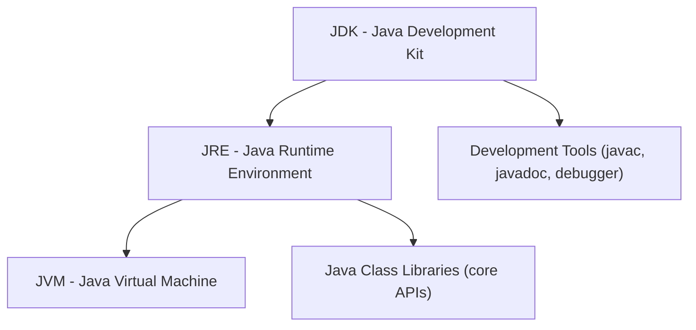
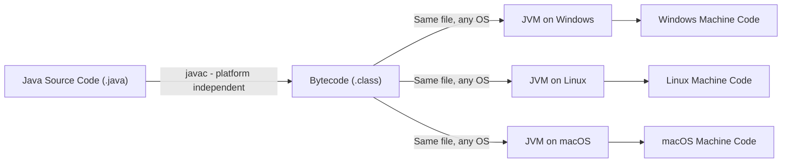
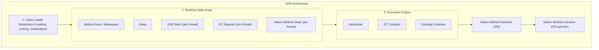
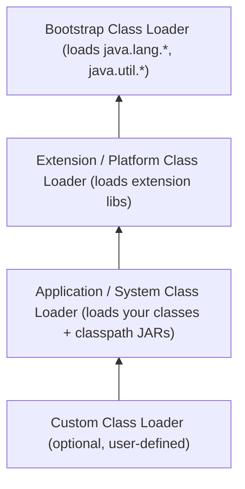
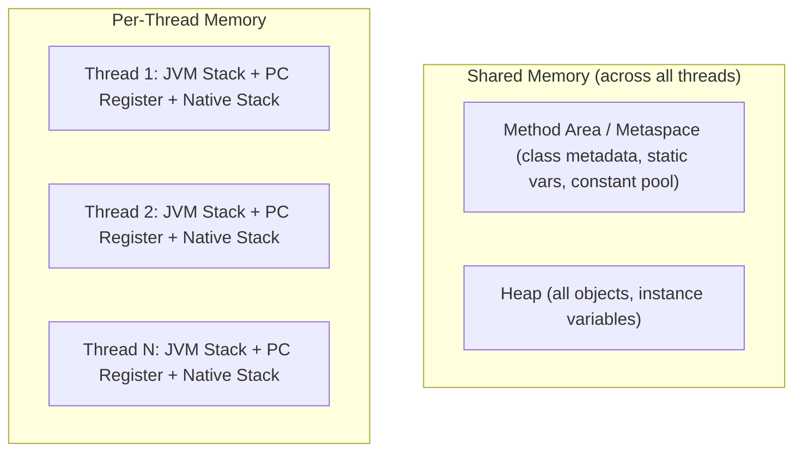
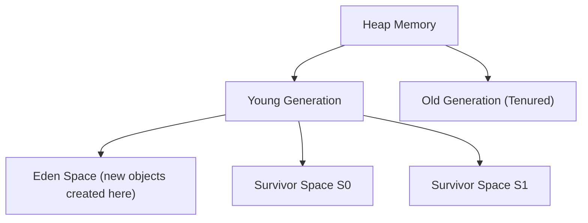
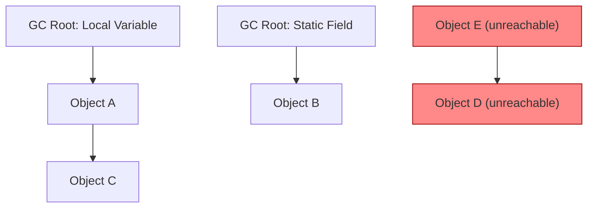
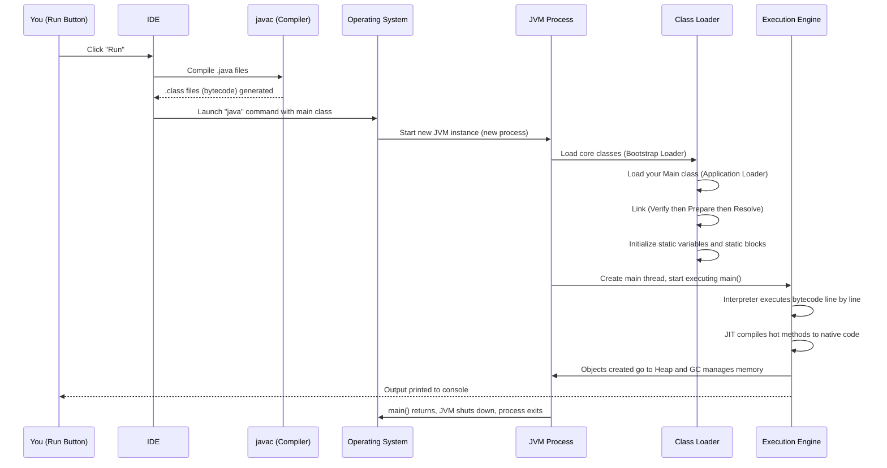

## JDK, JRE, and JVM

- **JVM** (Java Virtual Machine) — executes bytecode.
- **JRE** (Java Runtime Environment) — contains the JVM and the required libraries to run Java programs.
- **JDK** (Java Development Kit) — contains the JRE plus the compiler and development tools.

So:
- **JDK** is needed to *develop* programs.
- **JRE** is needed to *run* programs.
- **JVM** does the actual work of execution.

> **Note:** A simple analogy — JDK is a full toolbox (build + run), JRE is just the machine that runs the finished product, and JVM is the engine inside that machine.

---

## Java Runtime Environment (JRE)

This is a subset of the JDK and provides the necessary components to run Java applications. It includes:

- **Java Virtual Machine (JVM):** The core of the JRE, responsible for executing Java bytecode. It performs tasks like class loading, memory management, and garbage collection.
- **Java Class Libraries:** A set of pre-written classes and interfaces that provide common functionalities for Java applications.

During execution of a Java program, the JVM internally uses several tools such as loaders, linkers, managers, and verifiers. This collection of tools is known as the JRE, and all activities within it are controlled by the JVM.

---

## Development Tools (JDK)

The JDK provides various tools (e.g., `javac`) essential for developing, debugging, and managing Java applications.

> In essence, the JDK provides a complete ecosystem for Java development — from writing and compiling code to running and debugging applications.

---

## Bytecode

- Bytecode is the intermediate-level code in Java.
- It is generated by the compiler and is present inside the `.class` file.
- It is **not** a human-readable file (it's a set of instructions called "opcodes," viewable only via tools like `javap`).
- It is used by the JVM for execution purposes, hence it is known as Java execution code.

> **Note:** Bytecode is what makes Java portable — the same `.class` file can run on Windows, Linux, or macOS as long as a compatible JVM is installed.

---

## Javac (The Compiler)

- It is the name of the Java compiler.
- It is responsible for creating bytecode.
- It checks the source code for mistakes before producing the `.class` file with bytecode.
- If mistakes are found in the source code, it will display an error message.
- It is **not** part of the JVM — it is part of the JDK.

---

## Why Java is Platform Independent (In Depth)

Java's core promise is **"Write Once, Run Anywhere" (WORA)**. But this doesn't mean *everything* in Java is platform independent — only specific pieces are, while others must be platform-specific under the hood.

### The Core Idea

- When you compile a `.java` file using `javac`, it does **not** produce OS-specific machine code.
- Instead, it produces **bytecode** — a universal, intermediate instruction set that has no knowledge of the underlying OS or CPU architecture.
- This bytecode is exactly the same whether it is later run on Windows, Linux, macOS, or even embedded devices.
- The **JVM** installed on each platform is responsible for reading that same bytecode and translating it into instructions that specific machine can understand.

So the independence lives in the **bytecode**, not in the JVM.

### What IS Platform Independent

| Component | Why it's independent |
|---|---|
| **Java source code (`.java`)** | Plain text, written using Java syntax, same everywhere. |
| **Bytecode (`.class` file)** | A universal binary format defined by the JVM specification — identical on every OS. |
| **Java Standard Library / APIs** | Classes like `ArrayList`, `String`, `HashMap` behave identically regardless of OS because they're written in Java and compiled to the same bytecode. |
| **Compiled `.jar` files** | Just a bundle of `.class` files + metadata — portable across systems. |

### What is NOT Platform Independent (Platform Dependent)

| Component | Why it's dependent |
|---|---|
| **JVM implementation itself** | Each OS/architecture needs its own JVM binary (e.g., a Windows JVM `.exe`, a Linux JVM binary) written in native code (mostly C/C++) for that specific system. |
| **JIT-compiled native code** | Once the JVM's JIT compiler converts hot bytecode into native machine code at runtime, that native code is specific to the CPU/OS it was generated on. |
| **Native method libraries (JNI)** | Code that Java calls into via the `native` keyword (e.g., OS file system calls, hardware access) is platform-specific `.dll` / `.so` / `.dylib` binaries. |
| **File system paths, line separators** | `\` on Windows vs `/` on Linux/macOS — this is why Java provides `File.separator` to abstract this away. |
| **Some OS-level system calls** | Things like process creation, low-level threading, or native GUI rendering are implemented differently underneath, even if Java exposes a uniform API on top. |

> **Key takeaway:** Java code is platform independent because it compiles to bytecode. The JVM that interprets that bytecode is platform dependent — you install a different JVM binary per OS, but the same bytecode runs unmodified on all of them.

---

## JVM (Java Virtual Machine) — Full Architecture

The JVM is not a single component — it's made up of several subsystems that work together. Broadly, the JVM architecture is divided into **three major parts**:

1. **Class Loader Subsystem**
2. **Runtime Data Areas (Memory Areas)**
3. **Execution Engine**

...along with supporting pieces: **Native Method Interface (JNI)** and **Native Method Libraries**.

---

### 1. Class Loader Subsystem

Responsible for loading `.class` files into memory. It performs **three phases**: **Loading → Linking → Initialization**.

#### a) Loading

The class loader reads the `.class` file (bytecode) and creates a corresponding `Class` object in the **Method Area**. There are 4 types of class loaders, working in a strict hierarchy (parent-first / delegation model):

| Class Loader | Loads |
|---|---|
| **Bootstrap Class Loader** | Core Java classes (`java.lang.*`, `java.util.*`, etc.) from the `java.base` module. Written in native code, has no parent. |
| **Extension / Platform Class Loader** | Classes from extension directories or platform modules — extra JDK-provided classes not in core `java.*` packages. |
| **Application / System Class Loader** | Classes from your application's classpath — your own `.class` files and third-party JARs. |
| **Custom Class Loader** | User-defined class loaders (e.g., used by frameworks like Tomcat, plugin systems) for special loading logic (like hot-reloading or isolation). |

**Delegation Model (Parent-First):**
When a class needs to be loaded, the request is passed **up** the hierarchy first — the Application loader asks the Extension loader, which asks the Bootstrap loader. Only if none of the parents can find the class does the current loader try to load it itself.

> **Why delegation matters:** It prevents you from accidentally overriding core Java classes (like creating your own `java.lang.String`) — the request always goes to Bootstrap first, which will always resolve trusted core classes before anything custom gets a chance.

#### b) Linking

Linking has three sub-steps:

1. **Verification** — The bytecode verifier checks that the loaded `.class` file is structurally valid and doesn't violate JVM security constraints (e.g., no illegal type casts, no unsafe memory access). This is what makes Java memory-safe.
2. **Preparation** — Memory is allocated for static variables, and they are assigned **default values** (`0`, `null`, `false`, etc.) — not their actual initial values yet.
3. **Resolution** — Symbolic references (e.g., a class referring to another class/method/field by name) are resolved into direct references by looking them up in the Method Area.

#### c) Initialization

- Static variables are assigned their **actual** values, and **static blocks** are executed, in the order they appear in the code.
- This happens **top-down**, and only once per class (the first time it's actively used).

> **Note:** Loading, Linking, and Initialization together are sometimes just called "class loading," but technically they are three distinct phases with very different responsibilities.

---

### 2. Runtime Data Areas (JVM Memory Areas)

These are the memory regions the JVM sets up when it starts, used to store different kinds of data during execution.

| Area | Shared/Per-Thread | Stores |
|---|---|---|
| **Method Area (Metaspace since Java 8)** | Shared across all threads | Class-level data: class metadata, static variables, constant pool, method bytecode |
| **Heap** | Shared across all threads | All objects and instance variables (this is where `new` allocates memory) |
| **JVM Stack** | One per thread | Method call frames — local variables, partial results, method call/return data |
| **PC (Program Counter) Register** | One per thread | Address of the currently executing JVM instruction for that thread |
| **Native Method Stack** | One per thread | Stack used for executing native (non-Java, e.g., C/C++ via JNI) method calls |

#### Heap Memory — Zoomed In

The heap itself is further divided (this is the foundation of generational garbage collection):

- **Eden Space:** Almost every new object is first created here.
- **Survivor Spaces (S0, S1):** Objects that survive a garbage collection cycle in Eden are moved here; they bounce between S0 and S1 across multiple GC cycles.
- **Old Generation (Tenured):** Objects that survive many GC cycles in the Young Generation are "promoted" here — these are long-lived objects (e.g., cached data, singleton instances).

---

### 3. Execution Engine

Once bytecode is loaded and memory is set up, the **Execution Engine** actually runs the program. It has three key parts:

#### a) Interpreter
- Reads bytecode line-by-line and executes it directly.
- Fast to start, but slow for repeated execution since it re-interprets the same bytecode every single time.

#### b) JIT (Just-In-Time) Compiler
- Identifies **"hot" code** — methods/loops executed frequently.
- Compiles that hot bytecode into native machine code **once**, then reuses the compiled version on future calls instead of re-interpreting it.
- Modern JVMs (HotSpot) actually use **tiered compilation** with two internal JIT compilers:
  - **C1 (Client Compiler):** Compiles quickly with lighter optimizations — good for fast startup.
  - **C2 (Server Compiler):** Applies aggressive, deep optimizations — used for code that's extremely hot, at the cost of longer compilation time.

#### c) Garbage Collector (GC)
- Automatically frees heap memory occupied by objects that are no longer reachable/referenced by the running program.
- Covered in full detail in the next section.

> **Note:** The interpreter and JIT don't work in isolation — the JVM starts by interpreting everything, and progressively JIT-compiles methods as they get "hotter" (called many times), a strategy known as **adaptive optimization**.

---

### Native Method Interface (JNI) and Native Method Libraries

- **JNI (Java Native Interface):** A bridge that allows Java code to call functions written in other languages like C/C++, and vice versa.
- **Native Method Libraries:** The actual OS-specific compiled binaries (`.dll` on Windows, `.so` on Linux, `.dylib` on macOS) that JNI calls into — used for things like low-level hardware access, OS system calls, or performance-critical legacy code.

---

## Garbage Collection (GC) — In Depth

Garbage Collection is the process by which the JVM automatically identifies and removes objects from the heap that are no longer reachable, freeing up memory without the developer manually deallocating it (unlike C/C++'s `free()` / `delete`).

### GC Roots

An object is considered "alive" if it is **reachable** from a **GC Root** — a starting point the garbage collector uses to trace live objects. Common GC Roots include:

- Local variables and parameters on any thread's active stack.
- Active Java threads themselves.
- Static variables (referenced from the Method Area/Metaspace).
- JNI references (objects held by native code).

Any object with **no path back to a GC Root** is considered garbage and eligible for collection.

*(Objects D and E have no path from any GC Root — they are garbage and will be collected.)*

### Core GC Algorithms

1. **Mark and Sweep**
   - **Mark phase:** Traverse from GC Roots and mark every reachable object as "alive."
   - **Sweep phase:** Scan the entire heap and reclaim memory occupied by any unmarked (unreachable) object.
   - Downside: Leaves memory fragmented (free space scattered in small chunks).

2. **Mark-Compact**
   - Same marking phase as above, but after sweeping, it also **compacts** — shifts all live objects together to one end of memory, eliminating fragmentation.
   - Slightly slower than plain Mark-Sweep due to the extra compaction step, but avoids fragmentation issues.

3. **Copying Algorithm**
   - Divides memory into two equal halves. Live objects from the active half are copied into the other half, and the original half is then entirely cleared at once.
   - Very fast for areas with a high death rate (like Eden space), since it only touches *live* objects, not the garbage.
   - Downside: Wastes 50% of memory space by design (used in Young Generation, not Old Generation, for this reason).

4. **Generational Collection (the strategy Java actually uses)**
   - Based on the **"weak generational hypothesis"**: *most objects die young.*
   - The heap is split into Young Generation (Eden + Survivor spaces) and Old Generation.
   - New objects go into Eden. A **Minor GC** cleans Eden + Survivor spaces frequently (fast, using the Copying algorithm) — objects that survive multiple Minor GCs get **promoted** to the Old Generation.
   - The Old Generation is collected far less often via a **Major/Full GC** (usually using Mark-Sweep-Compact), since it mostly holds long-lived objects.

### Types of GC Events

| Type | What it collects | Frequency |
|---|---|---|
| **Minor GC** | Young Generation only | Frequent, fast |
| **Major GC** | Old Generation only | Less frequent |
| **Full GC** | Entire heap (Young + Old + Metaspace) | Rare, but causes the longest "stop-the-world" pause |

> **Note:** "Stop-the-world" means all application threads are paused while GC runs, to avoid inconsistent object graphs mid-collection. Modern collectors are designed specifically to minimize the duration/frequency of these pauses.

### JVM Garbage Collector Implementations

| Collector | Strategy | Best suited for |
|---|---|---|
| **Serial GC** | Single-threaded, stop-the-world, Mark-Sweep-Compact | Small applications, single-core environments |
| **Parallel GC (Throughput Collector)** | Multiple threads for Minor GC, focuses on maximizing throughput | Batch-processing apps where pause time matters less than overall throughput |
| **CMS (Concurrent Mark Sweep)** — *deprecated since Java 9, removed in Java 14* | Does most marking/sweeping concurrently with the app to reduce pause time | Older low-latency applications (now replaced by G1/ZGC) |
| **G1 GC (Garbage First)** — *default since Java 9* | Divides heap into many small regions, collects the regions with the most garbage first, balances throughput and pause time | General-purpose default for most modern applications |
| **ZGC** | Scalable, low-latency collector; pause times stay in single-digit milliseconds even on multi-terabyte heaps | Applications needing very large heaps with minimal pause times |
| **Shenandoah** | Similar goal to ZGC — ultra-low pause times via concurrent compaction | Low-latency systems, alternative to ZGC (OpenJDK) |

---

## Step-by-Step: What Happens When You Hit "Run" in Your IDE

This is the full journey from clicking the Run button to seeing output on the console.

### In plain steps:

1. **Compilation:** The IDE invokes `javac` behind the scenes, compiling every `.java` file into a corresponding `.class` file containing bytecode.
2. **JVM Launch:** The IDE runs the `java` command (e.g., `java Main`), which asks the OS to start a **new JVM process**.
3. **Class Loading:** The JVM's class loader subsystem kicks in — the Bootstrap loader loads core Java classes, and the Application loader loads your compiled class(es), following the parent-delegation model.
4. **Linking:** Your class's bytecode is verified for safety, static fields get default values, and symbolic references are resolved.
5. **Initialization:** Static variables get their real values, and static blocks execute top-to-bottom.
6. **Thread & Stack Setup:** The JVM creates the **main thread**, along with its own JVM stack and PC register.
7. **Execution Begins:** The Execution Engine starts interpreting the bytecode of your `main()` method line by line.
8. **Object Creation:** Any `new` keyword usage allocates memory in the **Heap** (starting in Eden space).
9. **JIT Kicks In:** If a method or loop is called repeatedly, the JIT compiler compiles it into native machine code so future calls run faster.
10. **Garbage Collection (as needed):** If Eden fills up, a Minor GC runs; long-lived objects eventually get promoted to Old Generation.
11. **Program Output:** Any `System.out.println()` calls send output through the JVM to your IDE's console.
12. **Termination:** Once `main()` finishes execution (or `System.exit()` is called), the JVM performs final cleanup and the process exits, handing control back to the OS and your IDE.

---

## Key Architectural Features (Summary)

**Platform Independence**
- Java code is compiled into bytecode, which runs on any system having the JVM.
- It follows the **"Write Once, Run Anywhere (WORA)"** capability.

**Robust and Secure**
- Strong memory management, exception handling, and automatic garbage collection make Java reliable and secure.
- Comes with a built-in security manager and bytecode verifier.

**Multithreading Support**
- Java allows execution of multiple tasks simultaneously, improving performance in games, animations, and real-time systems.

**High Performance**
- Java uses the JIT compiler to convert bytecode to native code at runtime for faster execution.

---

## Tokens in Java

Tokens are the smallest elements of a program that are meaningful to the compiler — the fundamental building blocks of the program. They are classified as:

1. Keywords
2. Identifiers
3. Constants / Literals
4. Operators
5. Separators

---

## Keywords in Java

- Keywords are reserved words that have a predefined meaning and are used by the compiler for internal processes or predefined actions.
- They cannot be declared as identifiers (variable names, method names, class names, etc.).
- Keywords are case sensitive — writing one in capital letters will throw an error.

**Examples:**

- **Data type keywords:** `boolean`, `byte`, `char`, `short`, `int`, `long`, `float`, `double`, `void`
- **Control flow keywords:** `if`, `else`, `switch`, `case`, `default`, `for`, `do`, `while`, `break`, `continue`, `return`
- **Exception handling keywords:** `try`, `catch`, `finally`, `throw`, `throws`
- **OOP keywords:** `class`, `interface`, `enum`, `extends`, `implements`, `new`, `this`, `super`, `abstract`, `final`, `static`

---

## Identifiers in Java

- An identifier is the name given to variables, classes, methods, packages, objects, interfaces, etc.
- These are unique names given by the user to identify each element in the program.
- Java keywords cannot be used as identifiers.

**Rules to define an identifier:**
- Allowed characters: alphanumeric characters `[A-Z]`, `[a-z]`, `[0-9]`, `$` (dollar sign), and `_` (underscore).
- Special characters other than `$` and `_` are not allowed.
- Identifiers should not start with a digit.
- Identifiers are case sensitive, with no restriction on length.

---

## Interview & Tricky Questions

1. **Can JRE run without JVM?**
   No. JVM is the core component inside JRE — without it, the JRE cannot execute any bytecode.

2. **If JDK contains JRE, why do we need JRE separately?**
   A JRE-only installation is meant for end users who just need to *run* Java applications, without the extra development tools (compiler, debugger) bundled in the JDK.

3. **Does the JIT compiler replace `javac`?**
   No. `javac` compiles source code to bytecode once, at compile time. The JIT compiler works at runtime, converting already-generated bytecode into native machine code for performance — they operate at different stages.

4. **Why is bytecode considered "platform independent" but the JVM is "platform dependent"?**
   Bytecode is a universal intermediate format that doesn't change across systems. The JVM, however, is compiled separately for each OS/hardware combination to translate that same bytecode into OS-specific machine code.

5. **Is bytecode the same as machine code?**
   No. Bytecode is an intermediate representation understood only by the JVM. Machine code is the final, hardware-specific code that the CPU actually executes.

6. **What's the difference between a keyword and an identifier?**
   Keywords are reserved words with fixed meaning in Java syntax (e.g., `class`, `static`), while identifiers are user-defined names for variables, methods, or classes — and identifiers can never reuse a keyword.

7. **Can an identifier contain a space or start with a number?**
   No. Identifiers cannot contain spaces or special characters (other than `$` and `_`), and they cannot start with a digit — `2value` is invalid, but `value2` is valid.

8. **Why does Java use both a compiler and an interpreter-like JVM instead of just one?**
   This hybrid model gives Java both portability (via compiled bytecode) and adaptability (via JVM execution), plus the JIT compiler adds near-native performance where it matters most.

9. **What are the three phases of class loading?**
   Loading (reading the `.class` file and creating a `Class` object), Linking (Verification → Preparation → Resolution), and Initialization (assigning real values to static fields and running static blocks).

10. **Why does Java use a parent-delegation model for class loading?**
    To ensure core Java classes are always loaded by the trusted Bootstrap loader first, preventing malicious or duplicate custom classes (like a fake `java.lang.String`) from silently overriding trusted JDK classes.

11. **What happens if you create a `java.lang.String` class yourself?**
    Due to parent delegation, when your code references `String`, the request goes up to the Bootstrap loader first, which finds and loads the real `java.lang.String` before your custom one is ever considered — so your custom class is effectively ignored for that reference.

12. **What is the difference between Minor GC, Major GC, and Full GC?**
    Minor GC cleans only the Young Generation (fast, frequent). Major GC cleans only the Old Generation. Full GC cleans the entire heap (Young + Old + Metaspace) and causes the longest pause.

13. **Why does Java use a Copying algorithm for the Young Generation but Mark-Sweep-Compact for the Old Generation?**
    Most objects in the Young Generation die quickly (weak generational hypothesis), so a fast Copying algorithm that only touches survivors is efficient. The Old Generation has mostly long-lived objects, so Mark-Sweep-Compact (which avoids the 50% memory waste of Copying) is more suitable there.

14. **What is a "stop-the-world" pause?**
    A pause where all application threads are frozen so the garbage collector can safely trace and reclaim memory without objects being mutated mid-collection.

15. **Why was PermGen removed and replaced with Metaspace in Java 8?**
    PermGen had a fixed maximum size, which frequently caused `OutOfMemoryError: PermGen space` in applications that loaded many classes dynamically (e.g., app servers). Metaspace uses native (off-heap) memory that can grow dynamically, largely eliminating that problem.

16. **What is the default garbage collector in modern Java versions?**
    **G1 (Garbage First) GC** has been the default since Java 9, balancing throughput and pause times by collecting heap regions with the most garbage first.

17. **Can an object be garbage collected even if a variable technically still points to it?**
    Yes — if that variable itself is unreachable from any GC Root (e.g., it belongs to a method that has already returned, or the enclosing object holding it is itself unreachable), the whole chain is eligible for collection.

18. **What triggers a Minor GC?**
    When the Eden space becomes full and cannot accommodate a new object allocation.

19. **What is Tiered Compilation in the JVM?**
    A strategy where the JVM starts by interpreting bytecode, uses the fast/lightweight C1 compiler for moderately hot code, and escalates to the aggressively optimizing C2 compiler for the hottest code paths — balancing startup speed and peak performance.

20. **Does every `.java` file get its own JVM process when run?**
    No — a single JVM process is launched per **program execution** (via the `java` command), and it can load and run many classes within that one process/instance.